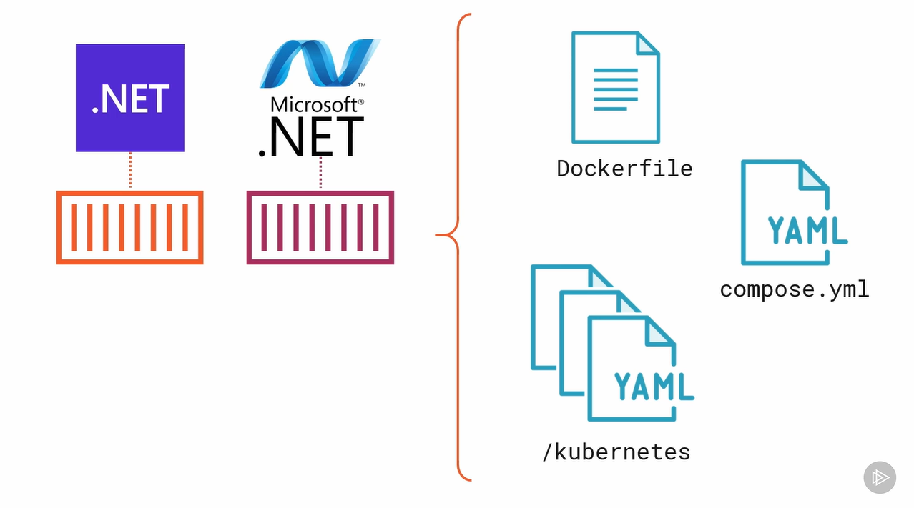
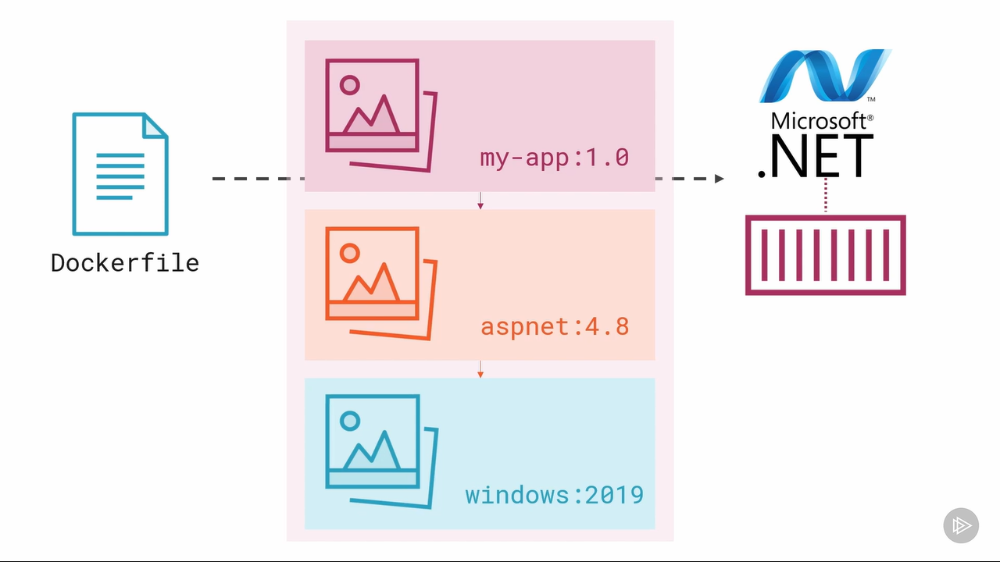

# Docker Start Guide

Below is my notes from a sample docker application study. :)

You can check for some docker guides here: [Docker Github](https://github.com/docker/).

## [[Docker]]
- Docker originated in the Linux world.
- It can run containers on Linux with various applications.
- Docker provides consistency in application deployment.


**[[Dockerfile]]**
- Utilize the `Dockerfile` to specify how to deploy your application.

**[[Docker Compose]]**
- Employ `compose.yml` to define and manage multi-container Docker applications.
- It centralizes tools for all application components.
- Storing your configuration in a **Compose** file offers the advantage of easy deletion and restart.

   Used Commands:
   `docker compose up -d`
   - The **-d** flag instructs Docker Compose to run in detached mode.

**[[Kubernetes]]**
- Use Kubernetes for running applications in production.
- Kubernetes allows you to centralize your tools on a single platform for all application components.

**Platform Compatibility**
- You can have a mix of Linux and Windows platforms within a single cluster.

**Dockerfile, Images, Applications**
- A Dockerfile is used to build container images that encapsulate your applications.

**Supported Workloads**
- Docker supports various types of workloads, including Docker Compose and Kubernetes.

**Volumes**
- Volumes are locations in your local filesystem managed by Docker.
- They facilitate data persistence in Docker applications.
- To add a volume, uncomment the volume lines in the `composer.yaml` file.

> [!example]
> ```yaml
> todo-database:
>   image: mongo:6
>   volumes:
>     - database:/data/db
>   ports:
>     - 27017:27017
> ```

> [!info]
> The **volumes** element nested in **todo-database** instructs Compose to mount the volume named **database** to **/data/db** in the container for the **todo-database** service.
> The top-level **volumes** element defines and configures a volume named **database** that can be utilized by any of the services in the Compose file.

**Bind Mounts**
*Docker isolates all content, code, and data in a container from your local filesystem. Sometimes you may want the container to access a directory on your system. This is when you use bind mounts.*
- Access local folders from a container.

---
**Questions:**
- How does Docker work on Windows?
- How do Docker images work?
- How can data be persisted in Docker applications?
  - Utilize [[Volumes]].
[[Nano Server]]
